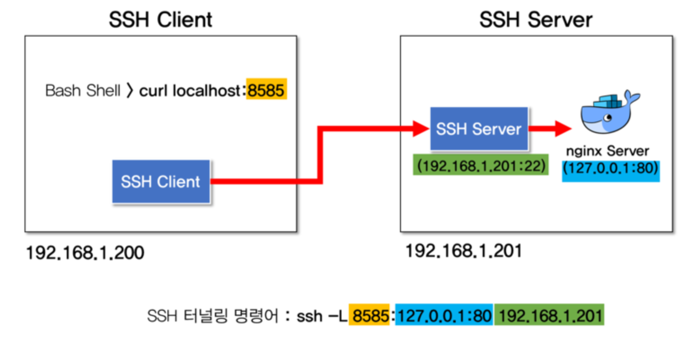
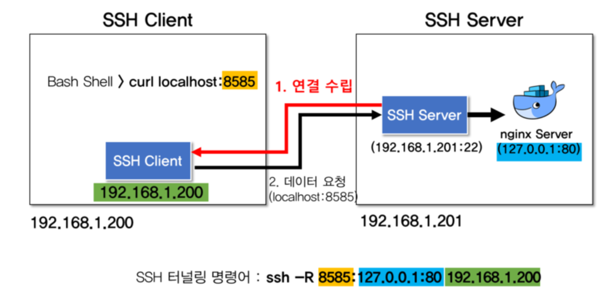

# Kiea Tunneling

## Reference

  - [SSH 포트 포워딩(SSH 터널링)의 개념 및 사용 방법](https://blog.naver.com/PostView.naver?blogId=alice_k106&logNo=221364560794)
  - [SSH Tunneling: Examples, Command, Server Config](https://www.ssh.com/academy/ssh/tunneling-example)
  - [SSH Tunneling](https://umbum.dev/18)
  - [SSH tunneling 을 이용하여 Port forwarding을 해보자](https://devbin.kr/ssh-tunneling-%EC%9D%84-%EC%9D%B4%EC%9A%A9%ED%95%98%EC%97%AC-port-forwarding%EC%9D%84-%ED%95%B4%EB%B3%B4%EC%9E%90/)

# Local Port Forwarding



```
[root@ssh-server ~] docker ps --format '{{.Names}}\t{{.Image}}\t{{.Ports}}'
vigilant_khorana        nginx   127.0.0.1:80->80/tcp
```

SSH-CLIENT> ssh -L localhost:8585:127.0.0.1:80 suser@192.168.1.201 -p [PORT] -fN (* -fN: execute background)
```
[root@ssh-client ~] ssh -L 8585:127.0.0.1:80 192.168.1.201
root@192.168.1.201's password:

Last login: Sun Sep 23 05:01:06 2018
[root@ssh-server ~]
```

```
[root@ssh-client ~] curl localhost:8585 -v
...
< HTTP/1.1 200 OK
< Server: nginx/1.15.3
< Date: Sun, 23 Sep 2018 09:06:43 GMT
< Content-Type: text/html
< Content-Length: 612
< Last-Modified: Tue, 28 Aug 2018 13:32:13 GMT
< Connection: keep-alive
< ETag: "5b854edd-264"
< Accept-Ranges: bytes
```

# Remote Port Forwarding



SSH-SERVER> ssh -R 192.168.1.200:8585:127.0.0.1:80 cuser@192.168.1.200 -p [PORT] -fN (* -fN: execute background)
```
[root@ssh-server ~] ssh -R 8585:127.0.0.1:80 192.168.1.200
root@192.168.1.200's password:

Last login: Sun Sep 23 05:30:37 2018 from ssh-client
[root@ssh-client ~]#
```

```
[root@ssh-client ~] curl localhost:8585 -v
....
> User-Agent: curl/7.29.0
> Host: localhost:8585
> Accept: */*
>
< HTTP/1.1 200 OK
< Server: nginx/1.15.3
< Date: Sun, 23 Sep 2018 09:40:40 GMT
....
```
